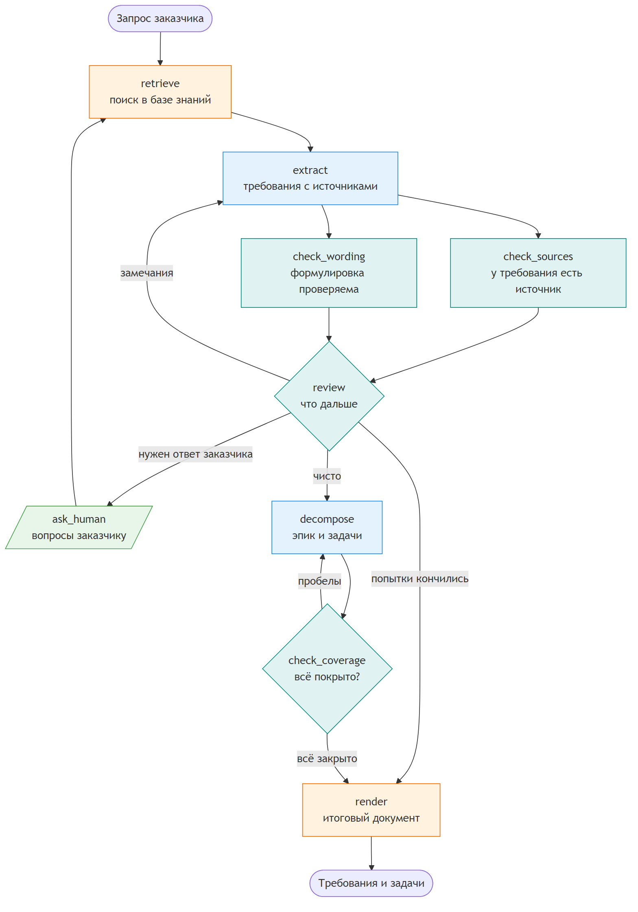

# ReqGraph

Граф агентов на LangGraph. Из сырого запроса заказчика собирает требования с источниками, вопросы заказчику и задачи для разработки с трассировкой.

Модель в нём делает то, что умеет, – формулирует. Всё, что можно проверить без неё, проверяет код: у каждого требования есть дословный источник, в формулировках нет «быстро» и «удобно», каждое требование закрыто задачей. Замечания уходят модели на доработку. Вопросы, на которые может ответить только заказчик, уходят человеку: граф останавливается и ждёт ответа.

## Зачем так

Модель охотно дописывает правдоподобные требования, которых никто не просил: сумму бонуса, срок, лимит. Просьба в промпте этого не отменяет. Поэтому правило «нет источника – нет требования» здесь проверяет код, одинаково на каждом прогоне, а модель только получает замечание и переделывает.

## Схема



Синие узлы работают на модели, бирюзовые – проверки кодом, зелёный – вопрос человеку, оранжевые – служебные. Исходник – [graph.mmd](docs/diagrams/src/graph.mmd). Тест сверяет рёбра на схеме с рёбрами настоящего графа, так что картинка не отстаёт от кода.

| **Узел** | **Кто** | **Что делает** |
|:---|:---|:---|
| retrieve | код | находит в базе знаний фрагменты по словам запроса и ответов заказчика |
| extract | модель | выделяет требования; у каждого – дословная цитата или ссылка на фрагмент базы знаний |
| check_sources | код | ищет цитату в запросе и ответах заказчика, ссылку – среди найденных фрагментов |
| check_wording | код | ловит слова, которые нельзя проверить на приёмке |
| review | код | сводит замечания; куда идти дальше, решает условное ребро |
| ask_human | человек | задаёт вопросы заказчику и ждёт ответов |
| decompose | модель | режет требования на эпик и задачи с критериями приёмки |
| check_coverage | код | проверяет, что каждое требование закрыто задачей, а задачи не ссылаются в пустоту |
| render | код | собирает итоговый документ |

## Что из LangGraph здесь работает

- **состояние** – `TypedDict`: журнал прогона копится редьюсером `operator.add`, остальные поля перезаписываются, [models.py](reqgraph/models.py);
- **параллельные узлы** – обе проверки идут одновременно, `review` ждёт обе: `add_edge(["check_sources", "check_wording"], "review")`;
- **условные рёбра и циклы** – два цикла доработки с потолком попыток. Когда попытки кончились, незакрытое попадает в документ разделом «Не закрыто», а не пропадает;
- **human-in-the-loop** – `interrupt()` в узле `ask_human`, чекпойнтер и возобновление через `Command(resume=...)`. При возобновлении узел выполняется с начала, поэтому до `interrupt()` в нём только чтение состояния;
- **RetryPolicy со своим `retry_on`** – стандартная политика не повторяет ответ модели, не прошедший схему: для неё это `ValueError`. Здесь такой ответ повторяется, и повтор не считается попыткой доработки;
- **structured output** – `with_structured_output` со схемами на Pydantic;
- **чекпойнтер со списком разрешённых классов** – `allowed_msgpack_modules`. Без него LangGraph 1.2 предупреждает, что поднимать незарегистрированные классы из сохранённого состояния скоро будет запрещено.

Весь граф – в [graph.py](reqgraph/graph.py), проверки – в [checks.py](reqgraph/checks.py).

## Пример

Запрос заказчика, [request.txt](examples/referral/request.txt):

> Коллеги, хотим реферальную программу в мобильном приложении: клиент делится ссылкой с другом, и когда друг оформит карту, обоим начисляется бонус. Важно, чтобы всё работало быстро и без мошенничества.

Ниже прогон на сценарной модели. Её первая версия требований нарочно содержит две типичные ошибки: выдуманную сумму бонуса и «быстро» вместо срока. Первая декомпозиция теряет два требования. Всё это ловит код:

```
retrieve: найдено 11 фрагментов базы знаний
extract, попытка 1: требований 5, вопросов 0
check_sources: без источника – R4
check_wording: непроверяемые формулировки – R3
review: замечаний 2, вопросов заказчику 0
extract, попытка 2: требований 4, вопросов 3
review: замечаний 0, вопросов заказчику 3
ask_human: ответов 3 из 3
retrieve: найдено 12 фрагментов базы знаний, новые: glossary.device
extract, попытка 3: требований 8, вопросов 0
review: замечаний 0, вопросов заказчику 0
decompose, попытка 1: задач 2
check_coverage: без задачи – R5, R8
decompose, попытка 2: задач 3
check_coverage: все требования закрыты задачами
```

Итог – [result.md](examples/referral/result.md): восемь требований, у каждого источник, три задачи с критериями приёмки и трассировка требование – задачи.

## Запуск

Проверено на Python 3.13.

```bash
python -m venv .venv
.venv/Scripts/python -m pip install -r requirements.txt    # Windows; в Linux и macOS – .venv/bin/python

.venv/Scripts/python -m reqgraph examples/referral/request.txt   # демо без ключа
.venv/Scripts/python -m reqgraph --mermaid                       # схема графа прямо из кода
.venv/Scripts/python -m pytest -q
```

Без ключа граф работает на сценарной модели: её ответы заранее записаны в [script.yaml](examples/referral/script.yaml). Она проходит тот же путь, что настоящая, – `with_structured_output`, вызов инструмента, разбор ответа, – но думает за неё сценарий.

С настоящей моделью – любой провайдер из списка `init_chat_model` в LangChain:

```bash
pip install langchain-openai
export OPENAI_API_KEY=...
python -m reqgraph examples/referral/request.txt --model openai:gpt-4o-mini
```

Локально, без передачи данных наружу:

```bash
pip install langchain-ollama
ollama pull qwen2.5:7b
python -m reqgraph examples/referral/request.txt --model ollama:qwen2.5:7b
```

Вопросы заказчику задаются в консоли. Ответы можно подать и файлом: `--answers answers.yaml`.

## Ограничения

- поиск по базе знаний идёт по основам слов, без эмбеддингов. Он детерминированный и объяснимый, но синонимы приходится перечислять в `keys`;
- чекпойнтер в памяти живёт в одном процессе. Для сервиса нужен постоянный, например Postgres-чекпойнтер LangGraph;
- проверки ловят отсутствие источника, непроверяемые слова и дыры в покрытии. Неверно понятую цитату они не видят – это остаётся человеку.

## Структура

```
reqgraph/        граф, проверки, промпты, итоговый документ, сценарная модель
kb/              база знаний: глоссарий, системы, типовые НФТ
examples/        запрос, сценарий модели, ответы заказчика, итоговый документ
tests/           проверки, прогон графа, сверка схемы с кодом
docs/diagrams/   схема графа: исходник и рендер
```

Лицензия – MIT.
